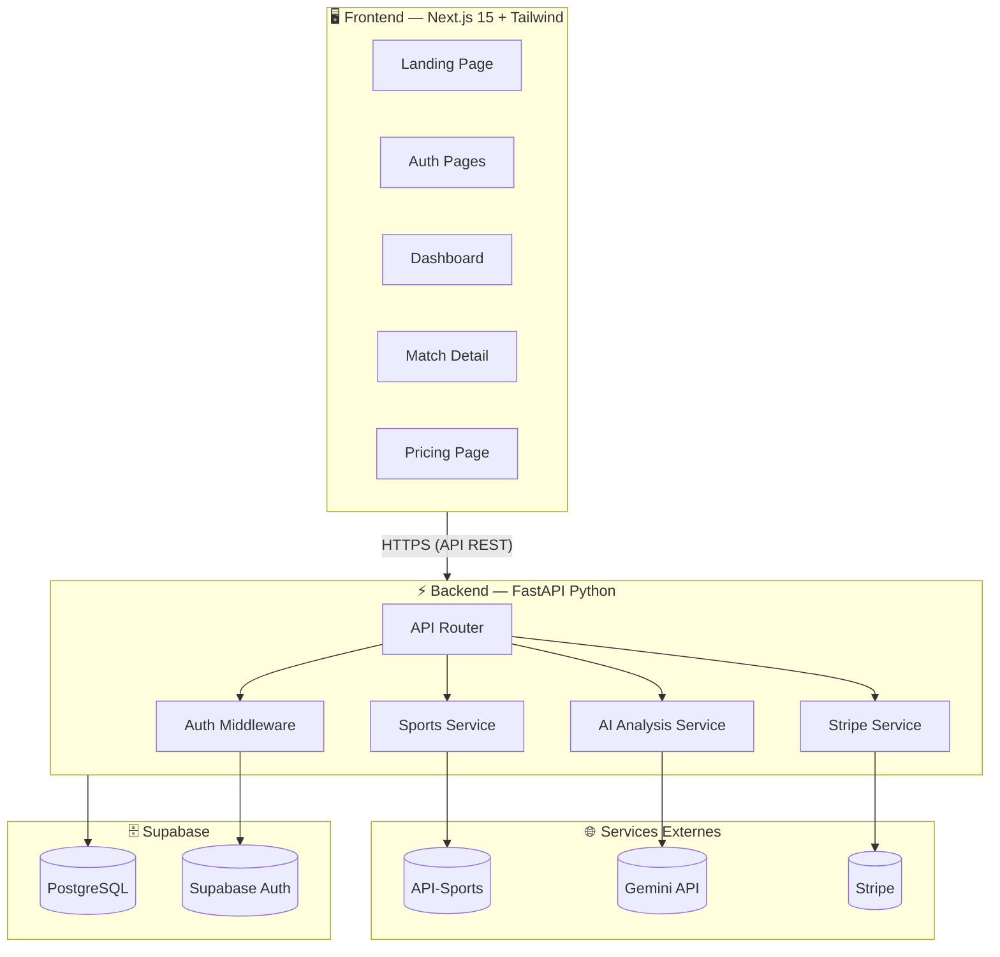
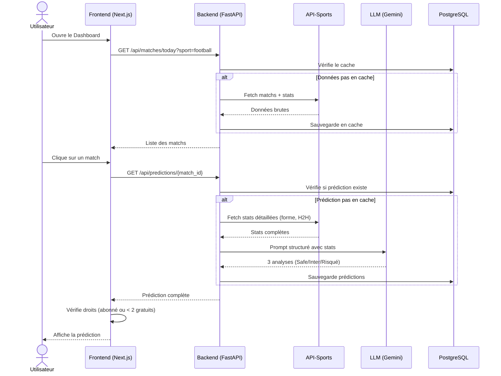

# 🏆 BETIX — Fiche Directrice du Projet

> **Document de référence** — Ce fichier est la boussole du projet. Toutes les décisions techniques validées y sont consignées. À consulter en priorité avant chaque phase de développement.

---

## 1. Présentation du Projet

**BETIX** est une plateforme SaaS premium de pronostics sportifs propulsée par l'Intelligence Artificielle.

| | |
|---|---|
| **Concept** | Transformer des statistiques sportives brutes en analyses textuelles et prédictions intelligentes via l'IA |
| **Type** | MVP Production-Ready (pas un prototype) |
| **Client** | Lilzer — monétisation par abonnement |
| **Sports** | ⚽ Football · 🏀 Basketball · 🎾 Tennis |

### Fonctionnalités Clés

- **Dashboard utilisateur** — Interface SaaS premium pour consulter les matchs du jour et les prédictions
- **Moteur d'analyse IA** — Récupération des données réelles (stats, forme, H2H) + analyse par LLM
- **3 niveaux de confiance** — Safe (Prudent) 🟢 · Intermédiaire 🟡 · Risqué (Cote élevée) 🔴
- **Système d'abonnement Stripe** — 2 pronostics gratuits, offre d'appel à 1€ le 1er mois, plans mensuels/annuels

---

## 2. Décisions Techniques Actées

### Stack Technologique

| Couche | Technologie | Justification |
|---|---|---|
| **Frontend** | Next.js 15 (App Router) + Tailwind CSS + TypeScript | SEO, SSR, rapidité de dev, écosystème riche |
| **Backend** | Python FastAPI | Écosystème IA mature, performance async, typage fort |
| **Base de données** | PostgreSQL via Supabase | Tier gratuit généreux (500 MB, 50k MAU), Auth intégré |
| **Authentification** | Supabase Auth | Intégré à la BDD, OAuth ready, JWT natif |
| **Paiements** | Stripe (Checkout + Webhooks) | Standard industrie, gestion auto des abonnements |
| **IA (Dev/Test)** | Google Gemini 2.0 Flash | Gratuit dans les limites, suffisant pour le workflow |
| **IA (Production)** | À définir après tests comparatifs | Choix basé sur rapport qualité/prix/pertinence |
| **Données sportives** | API-Sports (api-sports.io) — Plan Pro ~$30/mois | Une seule clé pour Football + Basketball + Tennis |

### Hébergement

| Service | Plateforme | Coût |
|---|---|---|
| **Frontend** | Vercel (tier gratuit) | $0 |
| **Backend** | Railway | ~$5-10/mois |
| **Base de données** | Supabase (tier gratuit) | $0 |

### Architecture : Frontend & Backend Séparés

Le frontend (Next.js) et le backend (FastAPI) sont deux projets distincts, communiquant via API REST. Ce choix permet :
- Un déploiement indépendant de chaque partie
- Une scalabilité flexible
- La possibilité de remplacer l'un sans toucher l'autre

### Approche IA : Prompt Engineering Enrichi

> Pas de vector store ni d'architecture RAG complexe pour le MVP.

L'approche retenue :
1. **Récupérer** les stats via API-Sports (forme, H2H, classement, blessures)
2. **Structurer** ces données en contexte lisible
3. **Injecter** le contexte dans un prompt spécialisé par sport
4. **Analyser** via le LLM pour générer 3 niveaux de prédiction

---

## 3. Architecture Globale

### Flux Principal : De la Donnée à la Prédiction

---

## 4. Principes Directeurs

1. **Production-ready** — Pas de bricolage. Code propre, architecture solide, UX soignée
2. **Coûts optimisés** — Tirer le maximum des tiers gratuits sans sacrifier la qualité
3. **Évolutif** — Le schéma BDD, les sports couverts, et le modèle IA évolueront selon les besoins
4. **Mobile-first** — Les utilisateurs cibles consultent principalement sur mobile
5. **Itératif** — On n'essaie pas de tout définir d'avance, on avance composant par composant

---

## 5. Budget Mensuel Estimé (MVP)

| Service | Coût |
|---|---|
| Vercel (Frontend) | **$0** |
| Railway (Backend) | **~$5-10** |
| Supabase (BDD + Auth) | **$0** |
| API-Sports Pro | **~$30** |
| Gemini Flash (Dev) | **$0** |
| Stripe | **2.9% + $0.30/transaction** |
| Domaine | **~$1/mois** (annualisé) |
| **Total** | **~$36-41/mois** + commission Stripe |

---

## 6. Planning de Développement

> **Approche Design-First** — On construit l'interface complète avec des données statiques d'abord, puis on intègre les données réelles. Le schéma BDD est défini par les besoins concrets de l'app, pas l'inverse.

### Phase 1 — Initialisation & Définition des APIs
- Setup des repos (Next.js + FastAPI)
- Configuration de l'environnement de développement
- Exploration et documentation des endpoints API-Sports (Football, Basketball, Tennis)
- Définition des contrats de données : quelles données on récupère, sous quelle forme
- Création des types TypeScript et modèles Pydantic correspondants

### Phase 2 — Frontend Design (Données Statiques)
- Définition du branding (palette, typographie, identité visuelle)
- Design system complet (composants UI réutilisables)
- **Toutes les pages construites avec des données mock** :
  - Landing page (vitrine publique)
  - Pages Auth (login, signup)
  - Dashboard (liste des matchs par sport)
  - Page détail match (prédiction complète avec les 3 niveaux)
  - Page tarifs (comparatif des plans)
- Responsive mobile-first
- **Objectif** : visualiser 100% de l'app et valider toutes les fonctionnalités avant l'intégration

### Phase 3 — Données Réelles & Base de Données
- Intégration API-Sports dans le backend (Football, Basketball, Tennis)
- Récupération des données réelles + système de cache
- **Construction du schéma BDD optimal** basé sur les données réelles ET les besoins de l'UI
- Création du projet Supabase + migration initiale
- Remplacement des données mock par les données réelles dans le frontend

### Phase 4 — Moteur d'Analyse IA
- Intégration Gemini API dans le backend
- Création des prompts spécialisés par sport
- Génération des 3 niveaux de prédiction (Safe / Intermédiaire / Risqué)
- Cache des prédictions en BDD
- Connexion avec le frontend (pages de prédiction)

### Phase 5 — Authentification
- Configuration Supabase Auth
- Pages login/signup fonctionnelles
- Protection des routes (middleware Next.js + vérification JWT backend)
- Gestion du profil utilisateur

### Phase 6 — Monétisation (Stripe)
- Intégration Stripe Checkout
- Création des plans d'abonnement (mensuel, annuel, offre 1€)
- Webhooks Stripe (backend)
- Gating des prédictions : 2 gratuites → paywall
- Page tarifs connectée à Stripe

### Phase 7 — Polish & Déploiement
- Tests de bout en bout (flux complet utilisateur)
- Optimisation UX, animations, micro-interactions
- Responsive final et tests multi-devices
- Déploiement production (Vercel + Railway)
- Documentation et configuration finale

---

*Dernière mise à jour : 11 février 2026*
