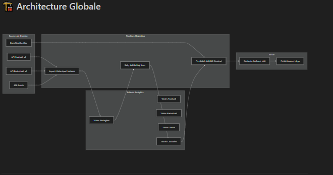
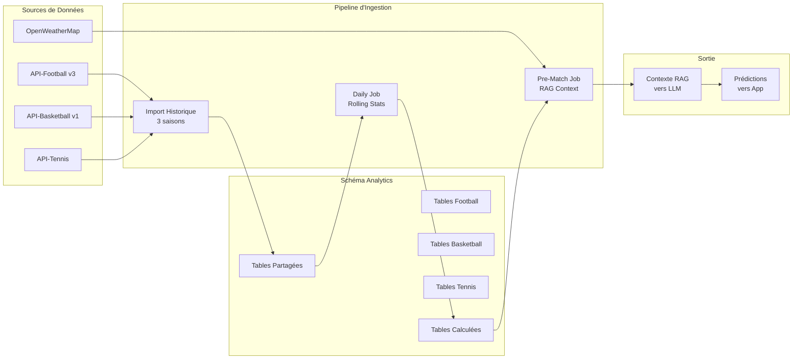
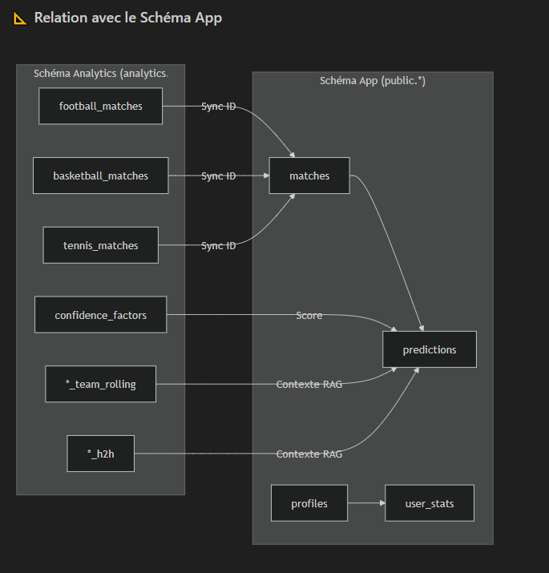

# 📚 Documentation Complète des Schémas de Données BETIX

Ce document archive les deux piliers de l'architecture de données de BETIX :
1.  **Schéma App (`public.*`)** : UI-Driven, gère utilisateurs, abonnements et affichage front.
2.  **Schéma Analytics (`analytics.*`)** : AI-Driven, gère les pipelines de données sportives et modèles prédictifs.

---

# PARTIE 1 : Architecture Base de Données App (UI-Driven)
*Source : database_schema_design.md*

Ce schéma est conçu sur mesure pour répondre aux besoins exacts identifiés lors de l'audit des 4 zones de l'application (Public, Auth, Dashboard, Admin). Il suit la philosophie "UI-Driven" : chaque table sert directement des composants visuels.

---

## 🏗️ 1. Module Utilisateurs & Auth
*Extension de la table système `auth.users` de Supabase.*

### `public.profiles`
*Stocke l'identité publique et les préférences.*
| Colonne | Type | Description | Source UI |
| :--- | :--- | :--- | :--- |
| `id` | `uuid` (PK) | FK vers `auth.users.id`. | Auth |
| `username` | `text` | Pseudo unique. | Signup / Profile |
| `avatar_url` | `text` | URL de l'image de profil. | Profile (Hero) |
| `role` | `text` | 'user', 'admin', 'super_admin'. | Admin Users |
| `onboarding_completed` | `boolean` | Si false -> Redirection `/onboarding`. | Onboarding |
| `betting_style` | `text` | 'casual', 'regular', 'analytical'. | Onboarding (Step 2) |
| `favorite_sports` | `text[]` | Array d'IDs : ['football', 'tennis']. | Onboarding (Step 1) |
| `created_at` | `timestamptz` | Date d'inscription. | Admin / Profile |
| `deleted_at` | `timestamptz` | Soft Delete (RGPD/Archivage). | Admin Safety |

### `public.user_settings`
*Préférences techniques (Control Deck).*
| Colonne | Type | Description | Source UI |
| :--- | :--- | :--- | :--- |
| `user_id` | `uuid` (PK) | FK vers `profiles.id`. | |
| `theme` | `text` | 'light', 'dark', 'system'. | Profile (Settings) |
| `notifications_push` | `boolean` | Active/Désactive les push. | Profile (Settings) |
| `newsletter_opt_in` | `boolean` | Abonnement email. | Profile (Settings) |

---

## 🎮 2. Module Gamification & Stats
*Alimente le "Performance Center" et le Header Profil.*

### `public.user_stats`
*Agrégats calculés (évite de recalculer à chaque vue).*
| Colonne | Type | Description | Source UI |
| :--- | :--- | :--- | :--- |
| `user_id` | `uuid` (PK) | FK vers `profiles.id`. | |
| `level` | `int` | Niveau actuel (ex: 42). | Profile (Hero) |
| `xp_current` | `int` | XP accumulée. | Profile (Progress Bar) |
| `xp_next` | `int` | XP requise pour prochain niveau. | Profile (Progress Bar) |
| `total_bets` | `int` | Nombre total de paris suivis. | Profile Stats |
| `win_rate` | `float` | % de réussite (0-100). | Profile Stats |
| `roi` | `float` | Retour sur investissement %. | Profile Stats |
| `current_streak` | `int` | Série en cours (+Win / -Loss). | Profile Stats |
| `total_profit` | `decimal` | Gains nets. | Profile Stats |

### `public.badges`
*Définition des trophées disponibles.*
| Colonne | Type | Description | Source UI |
| :--- | :--- | :--- | :--- |
| `id` | `text` (PK) | Slug (ex: 'sharpshooter'). | |
| `name` | `text` | Nom affiché (ex: "Sniper"). | Profile Badges |
| `description` | `text` | Condition d'obtention. | Profile Badges |
| `icon_ref` | `text` | Nom de l'icône Lucide. | Profile Badges |
| `rarity` | `text` | 'common', 'rare', 'epic', 'legendary'. | Profile Badges |

### `public.user_badges`
*Table de liaison User <-> Badges.*
| Colonne | Type | Description | Source UI |
| :--- | :--- | :--- | :--- |
| `user_id` | `uuid` (PK) | FK `profiles`. | |
| `badge_id` | `text` (PK) | FK `badges`. | |
| `unlocked_at` | `timestamptz` | Date d'obtention. | Profile Badges |

---

## ⚽ 3. Module Betting Engine (Simplifié)
*Alimente le Dashboard et la Liste des Matchs.*
*Note: Les données détaillées (lineups, h2h) seront stockées en JSONB ou via API-Sports.*

### `public.matches`
| Colonne | Type | Description | Source UI |
| :--- | :--- | :--- | :--- |
| `id` | `uuid` (PK) | ID interne. | |
| `api_sport_id` | `text` | ID externe (API-Sports). | Mapping |
| `sport` | `text` | 'football', 'basketball', 'tennis'. | Filters, Icons |
| `league_name` | `text` | Nom compétition. | MatchCard Header |
| `home_team` | `jsonb` | { "name": "Arsenal", "logo": "url", "code": "ARS" }. | MatchCard |
| `away_team` | `jsonb` | { "name": "Chelsea", "logo": "url", "code": "CHE" }. | MatchCard |
| `date_time` | `timestamptz` | Heure du coup d'envoi. | Dashboard Sort |
| `status` | `text` | 'upcoming', 'live', 'finished'. | MatchCard Badge |
| `score` | `jsonb` | { "home": 2, "away": 1, "mtime": "45+2'" }. | MatchCard Live |
| `tournament_meta` | `jsonb` | { "group": "A", "round": "Semi-Final", "neutral_ground": true }. | Match Detail |

### `public.predictions`
*Les analyses générées par l'IA.*
| Colonne | Type | Description | Source UI |
| :--- | :--- | :--- | :--- |
| `id` | `uuid` (PK) | | |
| `match_id` | `uuid` | FK `matches`. | |
| `type` | `text` | 'safe', 'value', 'risky'. | MatchCard Badge |
| `confidence` | `int` | 0-100. | MatchCard Badge |
| `outcome` | `text` | Le pari (ex: "Plus de 2.5 buts"). | Landing Demo |
| `odds` | `float` | La cote au moment du prono. | Landing Demo |
| `analysis_short` | `text` | Résumé pour les cards/liste. | Landing Demo |
| `analysis_full` | `text` | Analyse détaillée (Markdown). | Match Detail |
| `generation_snapshot` | `jsonb` | Score/Temps au moment du prono (Preuve d'intégrité). | Admin / Debug |
| `is_locked` | `boolean` | True si réservé Premium. | Gating Rules |

---

## 💳 4. Module Abonnements
*Gestion des accès et plans.*

### `public.plans`
| Colonne | Type | Description | Source UI |
| :--- | :--- | :--- | :--- |
| `id` | `text` (PK) | 'free', 'premium_monthly', 'premium_annual'. | Pricing Page |
| `name` | `text` | Nom commercial ("The Insider"). | Pricing Page |
| `price` | `decimal` | Prix affiché. | Pricing Page |
| `stripe_price_id` | `text` | ID pour Checkout Stripe. | Backend |
| `features` | `jsonb` | Liste des avantages. | Pricing Page |

### `public.subscriptions`
| Colonne | Type | Description | Source UI |
| :--- | :--- | :--- | :--- |
| `user_id` | `uuid` (PK) | FK `profiles`. | |
| `plan_id` | `text` | FK `plans`. | Profile Season Pass |
| `status` | `text` | 'active', 'past_due', 'canceled'. | Profile Season Pass, Admin |
| `current_period_end` | `timestamptz` | Date d'expiration/renouvellement. | Profile Season Pass |
| `source` | `text` | 'stripe' ou 'manual_gift' (Admin). | Admin Override |
| `stripe_subscription_id` | `text` (Nullable) | ID technique Stripe (Vide si cadeau). | Admin Settings |

---

## 🛠️ 5. Module Admin & Logs
*Supervision du système.*

### `public.system_logs`
| Colonne | Type | Description | Source UI |
| :--- | :--- | :--- | :--- |
| `id` | `bigint` (PK) | | |
| `created_at` | `timestamptz` | Timestamp. | Admin Terminal |
| `level` | `text` | 'info', 'warning', 'error', 'critical'. | Admin Terminal / Notifs |
| `source` | `text` | 'api-sports', 'stripe', 'ai-engine'. | Admin Terminal |
| `message` | `text` | Contenu du log. | Admin Terminal |

### `public.app_config`
*Configuration à chaud (Feature Flags).*
| Colonne | Type | Description | Source UI |
| :--- | :--- | :--- | :--- |
| `key` | `text` (PK) | ex: 'maintenance_mode', 'signup_enabled'. | Admin Settings |
| `value` | `jsonb` | Valeur du paramètre. | Admin Settings |
| `description` | `text` | Aide pour l'admin. | Admin Settings |

---
---

# PARTIE 2 : Schéma de Données — Moteur d'Analyse IA (Multi-Sport)
*Source : sports_analytics_schema.md*

Ce schéma est **séparé** du schéma applicatif. Il alimente exclusivement le **moteur de prédiction IA** et ses pipelines de données. Il est conçu pour stocker, calculer et servir les données nécessaires à une analyse de niveau expert pour les 3 sports : Football, Basketball et Tennis.

> [!IMPORTANT]
> Ce schéma coexiste avec le schéma App (Users, Subscriptions, etc.) dans la même base Supabase. Les tables ci-dessous sont préfixées `analytics.*` pour les distinguer.

---

## 🏗️ Architecture Globale

---

## 📦 1. Tables Partagées (Cross-Sport)

### `analytics.leagues`
*Référentiel des compétitions couvertes.*
| Colonne | Type | Description |
| :--- | :--- | :--- |
| `id` | `serial` PK | ID interne |
| `api_id` | `int` | ID externe (API-Sports / API-Tennis) |
| `sport` | `text` | `football`, `basketball`, `tennis` |
| `name` | `text` | Ex: "Premier League", "NBA", "ATP" |
| `country` | `text` | Ex: "England", "USA", "International" |
| `tier` | `text` | `major`, `minor`, `challenger` — Impacte le Confidence Score |
| `season_start` | `date` | Début de saison |
| `season_end` | `date` | Fin de saison |

### `analytics.teams`
*Référentiel des équipes (Football & Basketball).*
| Colonne | Type | Description |
| :--- | :--- | :--- |
| `id` | `serial` PK | ID interne |
| `api_id` | `int` | ID externe API-Sports |
| `sport` | `text` | `football`, `basketball` |
| `name` | `text` | Nom complet |
| `short_name` | `text` | Code court (ex: "ARS", "LAL") |
| `logo_url` | `text` | URL du logo |
| `league_id` | `int` FK | Ligue actuelle |
| `stadium_city` | `text` | Ville du stade (pour météo & travel) |
| `stadium_lat` | `decimal(9,6)` | Latitude (pour calcul distance) |
| `stadium_lon` | `decimal(9,6)` | Longitude |

### `analytics.players`
*Référentiel des joueurs (Tennis = individuel, Foot/Basket = clés).*
| Colonne | Type | Description |
| :--- | :--- | :--- |
| `id` | `serial` PK | ID interne |
| `api_id` | `int` | ID externe |
| `sport` | `text` | `football`, `basketball`, `tennis` |
| `name` | `text` | Nom complet |
| `team_id` | `int` FK (Nullable) | FK `teams` (NULL pour Tennis) |
| `position` | `text` | Ex: "Forward", "Guard", null (Tennis) |

### `analytics.odds_snapshots`
*Historique des cotes pré-match (Sentiment du marché).*
| Colonne | Type | Description |
| :--- | :--- | :--- |
| `id` | `bigserial` PK | |
| `match_id` | `int` FK | FK vers la table match du sport concerné |
| `sport` | `text` | `football`, `basketball`, `tennis` |
| `bookmaker` | `text` | Ex: "Bet365", "Unibet" |
| `snapshot_at` | `timestamptz` | Heure de capture |
| `home_win` | `decimal(5,2)` | Cote victoire domicile / joueur 1 |
| `draw` | `decimal(5,2)` | Cote nul (NULL pour Tennis/Basket) |
| `away_win` | `decimal(5,2)` | Cote victoire extérieur / joueur 2 |
| `over_under_line` | `decimal(4,1)` | Ligne Over/Under (ex: 2.5 buts, 210.5 pts) |
| `over_odds` | `decimal(5,2)` | Cote Over |
| `under_odds` | `decimal(5,2)` | Cote Under |

---

## ⚽ 2. Tables Football

### `analytics.football_matches`
| Colonne | Type | Description |
| :--- | :--- | :--- |
| `id` | `serial` PK | |
| `api_id` | `int` UNIQUE | ID fixture API-Football |
| `league_id` | `int` FK | FK `leagues` |
| `round` | `text` | Ex: "Regular Season - 15", "Semi-Final" |
| `date_time` | `timestamptz` | Coup d'envoi |
| `home_team_id` | `int` FK | FK `teams` |
| `away_team_id` | `int` FK | FK `teams` |
| `home_score` | `int` | Score final (NULL si pas joué) |
| `away_score` | `int` | |
| `status` | `text` | `scheduled`, `live`, `finished`, `postponed` |
| `referee_name` | `text` | Nom de l'arbitre (si connu) |
| `weather` | `jsonb` | `{"condition": "Rain", "temp_c": 12, "wind_ms": 8}` |

### `analytics.football_match_stats`
*Stats par équipe par match — Données brutes API.*
| Colonne | Type | Description |
| :--- | :--- | :--- |
| `match_id` | `int` FK | PK composite |
| `team_id` | `int` FK | PK composite |
| `possession_pct` | `decimal(4,1)` | Possession % |
| `shots_on_goal` | `int` | Tirs cadrés |
| `shots_total` | `int` | Tirs totaux |
| `passes_total` | `int` | Passes tentées |
| `passes_accurate` | `int` | Passes réussies |
| `fouls` | `int` | Fautes commises |
| `corners` | `int` | Corners |
| `yellow_cards` | `int` | Cartons jaunes |
| `red_cards` | `int` | Cartons rouges |
| `expected_goals` | `decimal(4,2)` | xG (NULL si ligue mineure) |

### `analytics.football_injuries`
| Colonne | Type | Description |
| :--- | :--- | :--- |
| `id` | `serial` PK | |
| `player_id` | `int` FK | FK `players` |
| `team_id` | `int` FK | FK `teams` |
| `match_id` | `int` FK | Match concerné (NULL si blessure à l'entraînement) |
| `type` | `text` | `injury`, `suspension`, `other` |
| `reason` | `text` | Ex: "Hamstring", "Red Card" |
| `status` | `text` | `out`, `doubtful`, `day_to_day` |
| `reported_at` | `date` | Date du signalement |

### `analytics.football_h2h`
*Agrégat des confrontations directes.*
| Colonne | Type | Description |
| :--- | :--- | :--- |
| `team_a_id` | `int` FK | PK composite (ID le plus petit) |
| `team_b_id` | `int` FK | PK composite |
| `total_matches` | `int` | |
| `team_a_wins` | `int` | |
| `draws` | `int` | |
| `team_b_wins` | `int` | |
| `avg_goals_a` | `decimal(3,1)` | Moyenne buts Team A |
| `avg_goals_b` | `decimal(3,1)` | |
| `last_5_results` | `jsonb` | `["W", "D", "L", "W", "W"]` (du point de vue de A) |
| `updated_at` | `timestamptz` | |

### `analytics.football_team_rolling`
*Stats glissantes recalculées quotidiennement.*
| Colonne | Type | Description |
| :--- | :--- | :--- |
| `team_id` | `int` FK | PK composite |
| `date` | `date` | PK composite |
| `venue` | `text` | PK composite: `home`, `away`, `all` |
| `l5_points` | `int` | Points sur 5 derniers matchs |
| `l5_ppm` | `decimal(3,2)` | Points Par Match |
| `l5_goals_for` | `decimal(3,1)` | Buts marqués (moy.) |
| `l5_goals_against` | `decimal(3,1)` | Buts encaissés (moy.) |
| `l5_clean_sheets` | `int` | Clean Sheets sur 5 derniers |
| `l5_xg_for` | `decimal(3,1)` | xG moyen (NULL si indispo) |
| `l5_xg_against` | `decimal(3,1)` | xGA moyen |
| `l5_possession_avg` | `decimal(4,1)` | Possession % moyenne |
| `l5_pass_accuracy` | `decimal(4,1)` | % Passes réussies |
| `l5_shots_avg` | `decimal(3,1)` | Tirs par match |

### `analytics.football_team_elo`
*Ratings ELO maison, recalculés après chaque match.*
| Colonne | Type | Description |
| :--- | :--- | :--- |
| `team_id` | `int` FK | PK composite |
| `date` | `date` | PK composite |
| `elo_rating` | `decimal(6,1)` | Rating ELO (Base: 1500) |
| `elo_change_1m` | `decimal(5,1)` | Variation sur 1 mois |

### `analytics.football_referee_stats`
*Agrégat des tendances arbitrales (recalcul mensuel).*
| Colonne | Type | Description |
| :--- | :--- | :--- |
| `referee_name` | `text` PK | |
| `season` | `int` | PK composite |
| `matches_officiated` | `int` | |
| `avg_yellow_cards` | `decimal(3,1)` | Par match |
| `avg_red_cards` | `decimal(3,2)` | Par match |
| `avg_fouls` | `decimal(4,1)` | Par match |
| `avg_penalties` | `decimal(3,2)` | Par match |

---

## 🏀 3. Tables Basketball

### `analytics.basketball_matches`
| Colonne | Type | Description |
| :--- | :--- | :--- |
| `id` | `serial` PK | |
| `api_id` | `int` UNIQUE | ID game API-Basketball |
| `league_id` | `int` FK | FK `leagues` |
| `date_time` | `timestamptz` | Tip-off |
| `home_team_id` | `int` FK | |
| `away_team_id` | `int` FK | |
| `home_score` | `int` | Score final |
| `away_score` | `int` | |
| `score_q1` | `jsonb` | `{"home": 28, "away": 25}` |
| `score_q2` | `jsonb` | |
| `score_q3` | `jsonb` | |
| `score_q4` | `jsonb` | |
| `score_ot` | `jsonb` | Overtime (NULL si pas de prolongation) |
| `status` | `text` | `scheduled`, `live`, `finished` |

### `analytics.basketball_match_stats`
*Stats par équipe par match.*
| Colonne | Type | Description |
| :--- | :--- | :--- |
| `match_id` | `int` FK | PK composite |
| `team_id` | `int` FK | PK composite |
| `fga` | `int` | Field Goals Attempted |
| `fgm` | `int` | Field Goals Made |
| `tpa` | `int` | 3-Point Attempted |
| `tpm` | `int` | 3-Point Made |
| `fta` | `int` | Free Throws Attempted |
| `ftm` | `int` | Free Throws Made |
| `off_rebounds` | `int` | Rebounds Offensifs |
| `def_rebounds` | `int` | Rebounds Défensifs |
| `assists` | `int` | Passes Décisives |
| `turnovers` | `int` | Balles Perdues |
| `steals` | `int` | Interceptions |
| `blocks` | `int` | Contres |
| `fouls` | `int` | Fautes |
| **Calculés** | | |
| `possessions` | `decimal(5,1)` | Dean Oliver Formula |
| `ortg` | `decimal(5,1)` | Offensive Rating (pts/100 poss) |
| `drtg` | `decimal(5,1)` | Defensive Rating |
| `efg_pct` | `decimal(4,1)` | Effective FG% |
| `tov_pct` | `decimal(4,1)` | Turnover % |
| `orb_pct` | `decimal(4,1)` | Offensive Rebound % |
| `ftr` | `decimal(4,1)` | Free Throw Rate |

### `analytics.basketball_injuries`
| Colonne | Type | Description |
| :--- | :--- | :--- |
| `id` | `serial` PK | |
| `player_id` | `int` FK | |
| `team_id` | `int` FK | |
| `status` | `text` | `out`, `gtd` (Game Time Decision), `probable` |
| `reason` | `text` | Ex: "Knee", "Rest (Load Management)" |
| `ppg_impact` | `decimal(4,1)` | Points/match perdus |
| `usg_pct` | `decimal(4,1)` | Usage Rate du joueur (% possessions) |
| `reported_at` | `date` | |

### `analytics.basketball_team_rolling`
*Stats glissantes + Fatigue.*
| Colonne | Type | Description |
| :--- | :--- | :--- |
| `team_id` | `int` FK | PK composite |
| `date` | `date` | PK composite |
| `venue` | `text` | PK composite: `home`, `away`, `all` |
| `l5_ortg` | `decimal(5,1)` | Offensive Rating L5 |
| `l5_drtg` | `decimal(5,1)` | Defensive Rating L5 |
| `l5_net_rtg` | `decimal(5,1)` | Net Rating L5 |
| `l5_pace` | `decimal(5,1)` | Pace L5 |
| `l5_efg_pct` | `decimal(4,1)` | eFG% L5 |
| `l10_ortg` | `decimal(5,1)` | Offensive Rating L10 |
| `l10_drtg` | `decimal(5,1)` | Defensive Rating L10 |
| `l10_net_rtg` | `decimal(5,1)` | Net Rating L10 |
| `season_ortg` | `decimal(5,1)` | Offensive Rating saison |
| `season_drtg` | `decimal(5,1)` | Defensive Rating saison |
| `rest_days` | `int` | Jours depuis dernier match |
| `is_b2b` | `boolean` | Back-to-Back flag |
| `games_in_7_days` | `int` | Matchs joués sur 7 jours |

### `analytics.basketball_h2h`
| Colonne | Type | Description |
| :--- | :--- | :--- |
| `team_a_id` | `int` FK | PK composite |
| `team_b_id` | `int` FK | PK composite |
| `season` | `int` | PK composite |
| `games_played` | `int` | |
| `team_a_wins` | `int` | |
| `avg_margin` | `decimal(4,1)` | Écart moyen |
| `last_results` | `jsonb` | `[{"date": "...", "score": "110-105", "winner": "A"}]` |
| `updated_at` | `timestamptz` | |

---

## 🎾 4. Tables Tennis

### `analytics.tennis_tournaments`
*Référentiel des tournois (critique pour le Confidence Score).*
| Colonne | Type | Description |
| :--- | :--- | :--- |
| `id` | `serial` PK | |
| `api_id` | `int` UNIQUE | |
| `name` | `text` | Ex: "Roland Garros", "Paris Masters" |
| `category` | `text` | `grand_slam`, `masters_1000`, `atp_500`, `atp_250`, `challenger`, `itf` |
| `surface` | `text` | `clay`, `hard`, `grass` |
| `indoor_outdoor` | `text` | `indoor`, `outdoor` |
| `prize_money_usd` | `int` | |

### `analytics.tennis_matches`
| Colonne | Type | Description |
| :--- | :--- | :--- |
| `id` | `serial` PK | |
| `api_id` | `int` UNIQUE | |
| `tournament_id` | `int` FK | FK `tennis_tournaments` |
| `round` | `text` | Ex: "Final", "R16", "Q2" |
| `date_time` | `timestamptz` | |
| `player1_id` | `int` FK | FK `players` |
| `player2_id` | `int` FK | FK `players` |
| `winner_id` | `int` FK | NULL si pas joué |
| `score` | `text` | Ex: "6-4, 3-6, 7-6(5)" |
| `duration_minutes` | `int` | |
| `sets_played` | `int` | |
| `status` | `text` | `scheduled`, `live`, `finished`, `retired`, `walkover` |
| `surface` | `text` | Dénormalisé depuis tournament pour perf |
| `indoor_outdoor` | `text` | Dénormalisé |

### `analytics.tennis_match_stats`
*Stats par joueur par match.*
| Colonne | Type | Description |
| :--- | :--- | :--- |
| `match_id` | `int` FK | PK composite |
| `player_id` | `int` FK | PK composite |
| `aces` | `int` | |
| `double_faults` | `int` | |
| `first_serve_pct` | `decimal(4,1)` | % 1ère balle |
| `first_serve_won_pct` | `decimal(4,1)` | % Points gagnés derrière 1ère |
| `second_serve_won_pct` | `decimal(4,1)` | % Points gagnés derrière 2nde |
| `bp_saved_pct` | `decimal(4,1)` | Break Points sauvés % |
| `bp_converted_pct` | `decimal(4,1)` | Break Points convertis % |
| `total_points_won` | `int` | Total points gagnés |
| **Calculés** | | |
| `return_won_pct` | `decimal(4,1)` | Dérivé: `(total_pts - serve_pts) / opp_serve_pts` |
| `service_games_held` | `int` | Jeux de service tenus (via score) |
| `return_games_won` | `int` | Breaks réalisés (via score) |

### `analytics.tennis_player_rolling`
*Stats glissantes par surface + fatigue.*
| Colonne | Type | Description |
| :--- | :--- | :--- |
| `player_id` | `int` FK | PK composite |
| `surface` | `text` | PK composite: `clay`, `hard`, `grass`, `all` |
| `date` | `date` | PK composite |
| `l5_win_pct` | `decimal(4,1)` | Win% L5 sur cette surface |
| `l10_win_pct` | `decimal(4,1)` | Win% L10 |
| `season_win_pct` | `decimal(4,1)` | Win% saison |
| `l10_aces_avg` | `decimal(4,1)` | Aces/match L10 |
| `l10_first_serve_pct` | `decimal(4,1)` | 1ère balle % L10 |
| `l10_first_serve_won` | `decimal(4,1)` | Points gagnés 1ère balle L10 |
| `l10_bp_saved_pct` | `decimal(4,1)` | BP sauvés % L10 |
| `l10_return_won_pct` | `decimal(4,1)` | Return Rating L10 |
| `l10_bp_converted_pct` | `decimal(4,1)` | BP convertis % L10 |
| `days_since_last_match` | `int` | Repos |
| `sets_played_l7` | `int` | Sets joués sur 7 jours |
| `minutes_played_l7` | `int` | Minutes jouées sur 7 jours |
| `fatigue_score` | `int` | 0-100 (100 = épuisé) |

### `analytics.tennis_h2h`
*Confrontations directes avec filtre surface.*
| Colonne | Type | Description |
| :--- | :--- | :--- |
| `player_a_id` | `int` FK | PK composite (ID le plus petit) |
| `player_b_id` | `int` FK | PK composite |
| `total_wins_a` | `int` | |
| `total_wins_b` | `int` | |
| `clay_wins_a` | `int` | Victoires A sur terre |
| `clay_wins_b` | `int` | |
| `hard_wins_a` | `int` | |
| `hard_wins_b` | `int` | |
| `grass_wins_a` | `int` | |
| `grass_wins_b` | `int` | |
| `indoor_wins_a` | `int` | |
| `indoor_wins_b` | `int` | |
| `last_meeting_date` | `date` | |
| `last_winner_id` | `int` FK | |
| `last_score` | `text` | |
| `updated_at` | `timestamptz` | |

### `analytics.tennis_rankings`
*Snapshots hebdomadaires pour calculer le momentum.*
| Colonne | Type | Description |
| :--- | :--- | :--- |
| `player_id` | `int` FK | PK composite |
| `date` | `date` | PK composite (Lundi de chaque semaine) |
| `rank` | `int` | Classement ATP/WTA |
| `points` | `int` | Points ATP/WTA |
| `rank_change_1m` | `int` | Variation rang sur 1 mois |
| `rank_change_3m` | `int` | Variation rang sur 3 mois |
| `trend` | `text` | `rising`, `stable`, `declining` |

---

## 🧮 5. Table de Confiance (Cross-Sport)

### `analytics.confidence_factors`
*Facteurs de modulation du Confidence Score de chaque prédiction.*
| Colonne | Type | Description |
| :--- | :--- | :--- |
| `id` | `serial` PK | |
| `match_id` | `int` | ID du match (sport déduit via `sport`) |
| `sport` | `text` | `football`, `basketball`, `tennis` |
| `base_score` | `int` | 100 (Base) |
| `league_tier_malus` | `int` | -30 si ITF/Challenger, -15 si ligue mineure |
| `missing_data_malus` | `int` | -20 si xG ou stats manquantes |
| `h2h_malus` | `int` | -10 si aucun H2H |
| `injury_uncertainty_malus` | `int` | -10 si GTD non résolu |
| `final_score` | `int` | Score final calculé (0-100) |
| `computed_at` | `timestamptz` | |

---

## 🔄 6. Pipeline de Mise à Jour

| Job | Fréquence | Action |
| :--- | :--- | :--- |
| **Import Historique** | One-time | 3 saisons (2023-2025) pour les 3 sports |
| **Daily Sync** | 1x/jour (06h00) | Importer matchs du jour, résultats de la veille |
| **Rolling Stats** | 1x/jour (06h30) | Recalculer L5/L10/Season pour toutes les équipes/joueurs |
| **ELO Update** | Après chaque match | Mettre à jour les ratings ELO (Football) |
| **H2H Refresh** | Après chaque match | Mettre à jour les agrégats H2H |
| **Referee Stats** | 1x/mois | Recalculer les tendances arbitrales |
| **Rankings** | 1x/semaine (Lundi) | Snapshot des classements Tennis |
| **Pre-Match Context** | H-2 avant match | Compiler le contexte RAG + fetch météo |
| **Odds Tracking** | H-24 → H-1 | Snapshots des cotes toutes les 6h |

