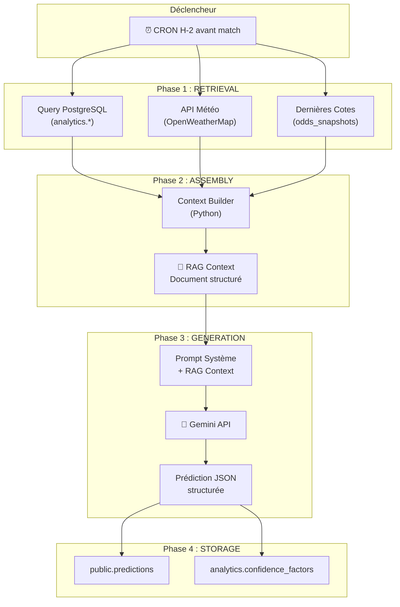
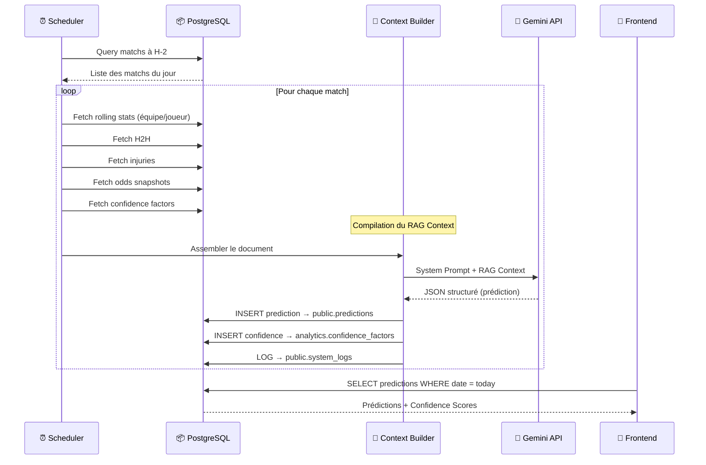

# 🧠 Méthodologie RAG — Moteur de Prédiction IA BETIX

> **RAG = Retrieval-Augmented Generation**
> Le LLM ne devine pas. Il **lit un dossier d'analyste** compilé automatiquement, puis rédige son verdict.

---

## 📐 Architecture Générale du Pipeline RAG



### Principe Fondamental

Le LLM **n'accède jamais directement aux APIs externes**. Il reçoit un **document de contexte pré-compilé** (le "RAG Context") qui contient toutes les données nécessaires, structurées et vérifiées. Cela garantit :

1. **Reproductibilité** — Le même contexte produit la même analyse
2. **Traçabilité** — Le `generation_snapshot` stocke le contexte exact utilisé
3. **Contrôle des coûts** — Un seul appel LLM par prédiction, pas de chaînes d'outils
4. **Qualité** — Les données sont nettoyées et validées avant d'atteindre le LLM

---

## ⚽ RAG Football

### Sources de Données Utilisées

| Donnée | Table Source | Fenêtre |
|:---|:---|:---|
| Forme récente (Dom/Ext) | `football_team_rolling` | L5 matchs |
| xG / xGA | `football_team_rolling` | L5 (ligues majeures) |
| Classement ELO | `football_team_elo` | Dernier snapshot |
| Blessures / Suspensions | `football_injuries` | Status actif |
| Confrontations directes | `football_h2h` | Historique complet |
| Tendance arbitrale | `football_referee_stats` | Saison en cours |
| Météo au stade | Fetch live (OpenWeatherMap) | H-2 |
| Mouvement des cotes | `odds_snapshots` | H-24 → H-1 |
| Contexte tournoi | `football_matches.round` | Match courant |

### Structure du RAG Context (Football)

```markdown
## 🏟️ MATCH CONTEXT
- Competition: Premier League — Matchday 25
- Date: 2025-02-15 15:00 UTC
- Venue: Emirates Stadium, London (Home: Arsenal)
- Referee: Michael Oliver (Season: 3.2 yellows/match, 0.31 penalties/match)
- Weather: Cloudy, 8°C, Wind 12 km/h

## 📊 HOME TEAM: ARSENAL (ELO: 1824, +45 last month)
### Form (Last 5 Home): W-W-D-W-W | PPM: 2.60
- Goals For: 2.4/match | Goals Against: 0.6/match
- xG: 2.1/match | xGA: 0.8/match | Clean Sheets: 3/5
- Possession: 62.4% | Pass Accuracy: 88.2%
### Key Absences:
- Bukayo Saka (Hamstring) — OUT | Impact: Key creator
- Martin Ødegaard (Knee) — DOUBTFUL

## 📊 AWAY TEAM: CHELSEA (ELO: 1756, -12 last month)
### Form (Last 5 Away): L-W-L-D-W | PPM: 1.40
- Goals For: 1.2/match | Goals Against: 1.6/match
- xG: 1.3/match | xGA: 1.5/match | Clean Sheets: 1/5
- Possession: 55.1% | Pass Accuracy: 84.7%
### Key Absences:
- None reported

## 🔄 HEAD-TO-HEAD (Last 20 meetings)
- Arsenal: 9W | Draws: 5 | Chelsea: 6W
- Avg Goals Arsenal: 1.6 | Avg Goals Chelsea: 1.1
- Last 5: [W, D, L, W, W] (Arsenal perspective)

## 💰 MARKET SENTIMENT (Odds Movement H-24 → H-1)
- Arsenal Win: 1.65 → 1.58 (SHORTENING — Money on Arsenal)
- Draw: 3.80 → 4.00 (DRIFTING)
- Chelsea Win: 5.50 → 5.80 (DRIFTING)
- Over 2.5: 1.75 → 1.70 (SHORTENING)
```

### Prompt Système (Football)

```
Tu es un analyste sportif senior spécialisé en football.
Tu reçois un dossier d'analyse pré-match. Ton rôle :

1. ANALYSER les données factuelles du dossier
2. IDENTIFIER les facteurs clés (forme, xG, absences, H2H, météo, cotes)
3. PRODUIRE une prédiction structurée en JSON

Règles :
- Ne jamais inventer de données non présentes dans le dossier
- Si xG = NULL, mentionner que l'analyse est basée sur les stats classiques
- Pondérer la forme récente > historique H2H > cotes
- Le Confidence Score reflète la QUALITÉ des données, pas ta certitude

Format de sortie :
{
  "type": "safe|value|risky",
  "confidence": 0-100,
  "outcome": "Description du pari",
  "odds": 1.XX,
  "analysis_short": "Résumé 1 ligne",
  "analysis_full": "Analyse détaillée en Markdown (3-5 paragraphes)"
}
```

---

## 🏀 RAG Basketball

### Sources de Données Utilisées

| Donnée | Table Source | Fenêtre |
|:---|:---|:---|
| Ratings Off/Def | `basketball_team_rolling` | L5, L10, Saison |
| Four Factors (eFG%, TOV%, ORB%, FTR) | `basketball_match_stats` (calculés) | L5 |
| Pace | `basketball_team_rolling` | L5, L10 |
| Fatigue (B2B, Rest Days) | `basketball_team_rolling` | Temps réel |
| Blessures + Impact | `basketball_injuries` | Status actif |
| Confrontations directes | `basketball_h2h` | Saison en cours |
| Mouvement des cotes | `odds_snapshots` | H-24 → H-1 |

### Structure du RAG Context (Basketball)

```markdown
## 🏟️ MATCH CONTEXT
- League: NBA — Regular Season
- Date: 2025-02-15 19:30 EST
- Venue: Crypto.com Arena, Los Angeles (Home: Lakers)

## 📊 HOME TEAM: LOS ANGELES LAKERS
### Efficiency (Last 5 Home)
- ORtg: 118.2 | DRtg: 110.5 | Net: +7.7
- Pace: 102.3 possessions/game
### Four Factors (L5):
- eFG%: 54.2% | TOV%: 12.8% | ORB%: 28.1% | FTR: 0.31
### Season Ratings:
- ORtg: 115.1 | DRtg: 112.3 | Net: +2.8
### Fatigue:
- Rest Days: 2 | Back-to-Back: NO | Games in 7 days: 3
### Key Absences:
- Anthony Davis (Ankle) — GTD | Impact: 25.3 PPG, 31.2% USG

## 📊 AWAY TEAM: BOSTON CELTICS
### Efficiency (Last 5 Away)
- ORtg: 121.5 | DRtg: 106.2 | Net: +15.3
- Pace: 99.8 possessions/game
### Four Factors (L5):
- eFG%: 57.1% | TOV%: 11.2% | ORB%: 24.5% | FTR: 0.28
### Season Ratings:
- ORtg: 119.8 | DRtg: 108.1 | Net: +11.7
### Fatigue:
- Rest Days: 1 | Back-to-Back: YES | Games in 7 days: 4
### Key Absences:
- None reported

## 🔄 HEAD-TO-HEAD (Season)
- Games: 2 | Celtics: 2W-0L | Avg Margin: +8.5
- Last: Celtics 118-105 (2025-01-20)

## 💰 MARKET SENTIMENT
- Lakers ML: +155 → +145 (SHORTENING)
- Celtics ML: -180 → -170 (DRIFTING)
- Total: 228.5 | Over: -110 | Under: -110
```

### Logique d'Analyse Spécifique Basketball

Le prompt système pour le Basketball insiste sur des facteurs différents du Football :

```
Facteurs de pondération Basketball :
1. NET RATING L5 (Différentiel Off/Def récent) — Poids: 30%
2. FATIGUE (B2B + Games in 7 days) — Poids: 25%
   - Un B2B pour l'équipe extérieure = malus significatif
   - > 4 matchs en 7 jours = "schedule loss" potentiel
3. FOUR FACTORS (eFG%, TOV%) — Poids: 20%
   - eFG% est le meilleur prédicteur simple de victoire
4. INJURIES PPG IMPACT — Poids: 15%
   - Un joueur > 25% USG absent = recalibrer l'attaque
5. H2H + COTES — Poids: 10%
   - H2H moins pertinent en NBA qu'en football (rotation, matchups)
```

---

## 🎾 RAG Tennis

### Sources de Données Utilisées

| Donnée | Table Source | Fenêtre |
|:---|:---|:---|
| Forme par surface | `tennis_player_rolling` | L5, L10 (filtre surface) |
| Stats de service | `tennis_player_rolling` | L10 |
| Stats de retour | `tennis_player_rolling` | L10 |
| Fatigue (jours repos, sets L7) | `tennis_player_rolling` | Temps réel |
| Classement + Tendance | `tennis_rankings` | Dernier snapshot |
| Confrontations directes | `tennis_h2h` | Historique + filtre surface |
| Catégorie tournoi | `tennis_tournaments` | Match courant |
| Mouvement des cotes | `odds_snapshots` | H-24 → H-1 |

### Structure du RAG Context (Tennis)

```markdown
## 🏟️ MATCH CONTEXT
- Tournament: Roland Garros (Grand Slam)
- Surface: CLAY | Outdoor
- Round: Quarter-Final
- Date: 2025-06-04 14:00 CET

## 📊 PLAYER 1: CARLOS ALCARAZ
### Rankings: #2 ATP (Trend: STABLE, +0 last month)
### Form on CLAY (Last 10): 8W-2L (80.0%)
- Season overall: 32W-5L (86.5%)
### Serve (L10 on Clay):
- 1st Serve %: 68.2% | 1st Serve Won: 72.5%
- Aces/match: 6.3 | Double Faults/match: 2.1
- BP Saved: 67.8%
### Return (L10 on Clay):
- Return Won %: 42.1% | BP Converted: 45.3%
### Fatigue:
- Days since last match: 2
- Sets played (last 7 days): 8
- Minutes played (last 7 days): 380
- Fatigue Score: 55/100 (MODERATE)

## 📊 PLAYER 2: JANNIK SINNER
### Rankings: #1 ATP (Trend: STABLE, +0 last month)
### Form on CLAY (Last 10): 7W-3L (70.0%)
- Season overall: 35W-3L (92.1%)
### Serve (L10 on Clay):
- 1st Serve %: 65.1% | 1st Serve Won: 70.8%
- Aces/match: 5.1 | Double Faults/match: 1.8
- BP Saved: 62.4%
### Return (L10 on Clay):
- Return Won %: 39.8% | BP Converted: 41.2%
### Fatigue:
- Days since last match: 1
- Sets played (last 7 days): 11
- Minutes played (last 7 days): 520
- Fatigue Score: 72/100 (HIGH)

## 🔄 HEAD-TO-HEAD
- Total: Alcaraz 5W — Sinner 4W
- On Clay: Alcaraz 3W — Sinner 1W
- Last meeting: Alcaraz def. Sinner 6-3, 6-4 (Monte Carlo 2025, Clay)

## 💰 MARKET SENTIMENT
- Alcaraz: 1.62 → 1.55 (SHORTENING)
- Sinner: 2.30 → 2.45 (DRIFTING)

## ⚠️ CONFIDENCE MODIFIERS
- Tournament Category: Grand Slam → No malus
- Data Completeness: Full stats available → No malus
- H2H on Surface: 4 matches on clay → No malus
- Base Confidence: 100/100
```

### Logique d'Analyse Spécifique Tennis

```
Facteurs de pondération Tennis :
1. FORME SUR LA SURFACE ACTUELLE — Poids: 30%
   - La surface est LE discriminant #1 en tennis
   - Un joueur top 5 sur hard peut être R16 sur clay
2. STATS SERVICE + RETOUR (sur la surface) — Poids: 25%
   - "Return Won %" est la métrique la plus prédictive
   - Sur gazon, la 1ère balle % domine
3. FATIGUE SCORE — Poids: 20%
   - Un 5-setter la veille = risque de tanking/underperformance
   - Fatigue Score > 70 = alerte rouge
4. H2H SUR LA SURFACE — Poids: 15%
   - H2H global sans filtre surface = BRUIT (ignorer)
   - Ex: Nadal vs Djokovic sur terre ≠ sur dur
5. RANKINGS + TENDANCE — Poids: 10%
   - Un joueur "rising" (+20 places en 3 mois) > joueur "declining"
```

---

## 🧮 Mécanisme du Confidence Score

Le score de confiance n'est **pas** la probabilité de gagner.
C'est la **fiabilité de l'analyse** elle-même.

### Calcul

```
BASE = 100

MALUS appliqués :
├── League Tier
│   ├── Grand Slam / Top 5 Leagues / NBA     → 0
│   ├── ATP 250 / Ligue 2 / EuroLeague       → -15
│   └── ITF / Challenger / Liga 3             → -30
├── Missing Data
│   ├── xG indisponible (Football)            → -10
│   ├── Stats de match absentes (Tennis ITF)  → -20
│   └── Pas de box score détaillé (Basket)    → -15
├── H2H
│   ├── 0 confrontations directes             → -10
│   └── < 3 confrontations sur la surface     → -5 (Tennis)
└── Injury Uncertainty
    ├── Joueur clé en GTD non résolu          → -10
    └── > 3 joueurs clés absents              → -5

FINAL_SCORE = max(0, BASE - sum(malus))
```

### Affichage Utilisateur

| Score | Badge | Couleur | Signification |
|:---:|:---|:---|:---|
| 85-100 | `HIGH CONFIDENCE` | 🟢 Vert | Données complètes, analyse fiable |
| 65-84 | `MODERATE` | 🟡 Jaune | Quelques lacunes, à pondérer |
| 40-64 | `LOW` | 🟠 Orange | Données limitées, prudence |
| 0-39 | `SPECULATIVE` | 🔴 Rouge | Analyse très incertaine |

---

## 🔄 Cycle de Vie Complet d'une Prédiction



### Timing du Pipeline

| Étape | Heure | Durée estimée |
|:---|:---|:---|
| Daily Sync (résultats veille) | 06:00 | ~5 min |
| Rolling Stats Recalc | 06:30 | ~10 min |
| H2H / ELO Updates | 06:45 | ~5 min |
| Odds Tracking (snapshots) | Toutes les 6h | ~2 min |
| Pre-Match Context Build | H-2 | ~30s / match |
| LLM Generation | H-2 + 1min | ~5s / match |
| Résultat disponible en App | H-2 + 2min | Immédiat |

---

## 📌 Règles d'Or du Système RAG

1. **Le LLM ne cherche rien** — Il reçoit un dossier complet, point final
2. **Pas de hallucination** — Si une donnée manque, le Confidence Score baisse
3. **Surface = Roi (Tennis)** — Toujours filtrer par surface, jamais d'agrégat global seul
4. **Fatigue ≠ Repos (Basket)** — Un B2B extérieur vaut plus qu'un malus ELO
5. **Les cotes ne prédisent pas** — Elles confirment ou infirment un sentiment
6. **Traçabilité totale** — Chaque prédiction stocke son `generation_snapshot`
7. **Un seul appel LLM** — Pas de chaînes, pas de re-prompting, pas d'agents multiples
